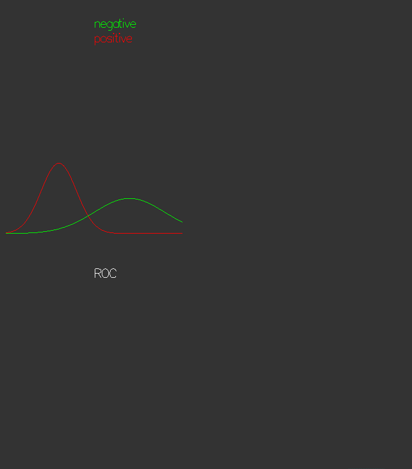

* To run the application one needs to have installed OpenGL and glut header, lib and dll for Win32. Currently glut is available [here](https://user.xmission.com/~nate/glut.html). Put `glut.h` and `glut32.lib` into `./GL` folder and `glut32.dll` into `.\Bin` folder.

Using two idealistic distribution of positive and negative cases the application demostrates building [ROC][1]-curve from confusion matrix and then converting it to [PR][2]-curve.

  [1]: https://en.wikipedia.org/wiki/Receiver_operating_characteristic
  [2]: https://en.wikipedia.org/wiki/Precision_and_recall
